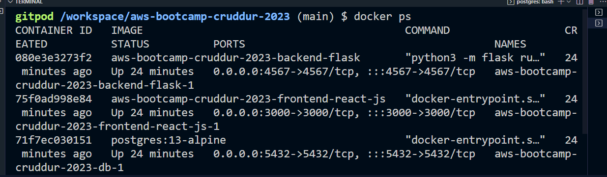
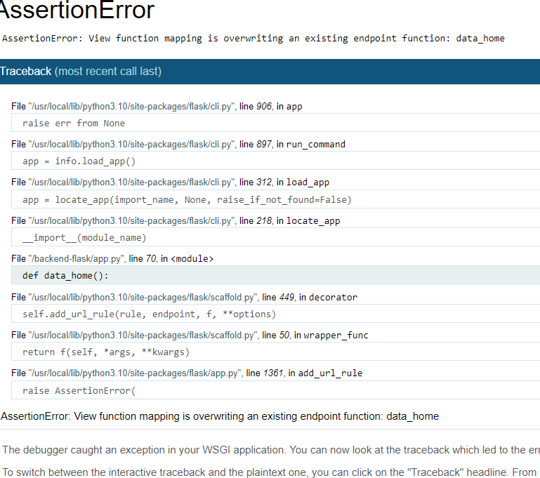
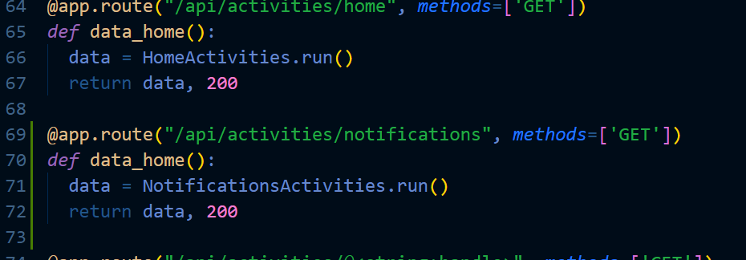
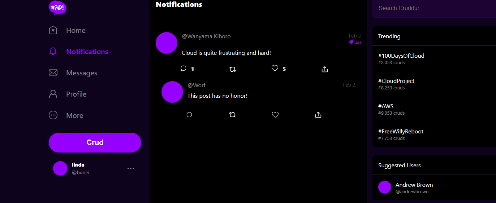
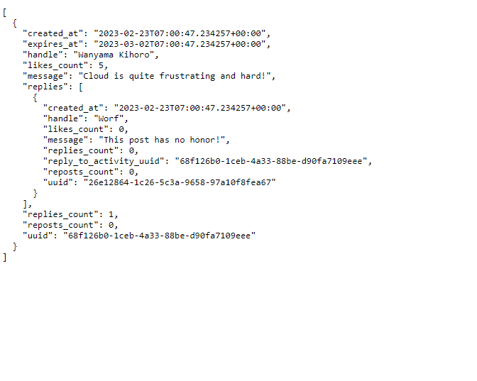
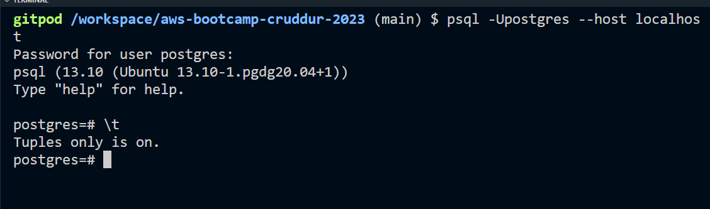
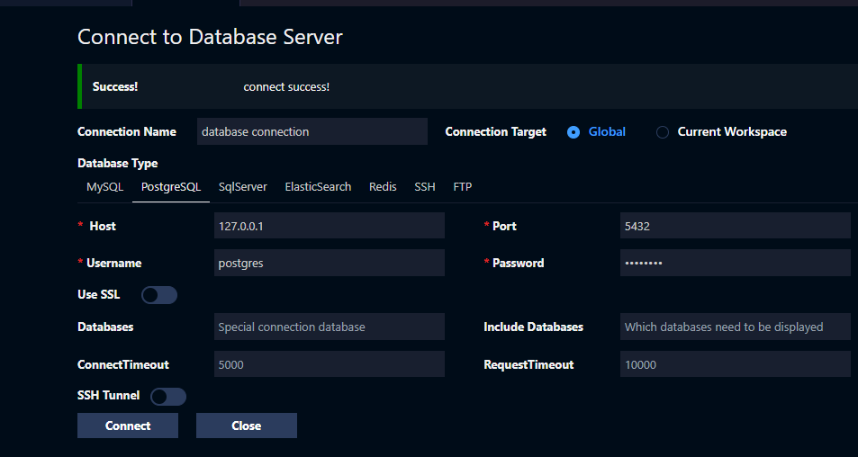

# Week 1 — App Containerization

This week we were introduced to docker, we created dockerfiles  containing various instructions and confugurations
learnt various commands i.e

Docker ps-existing containers

docker images-running containers

docker port(docker_id)-tells you the port configuration number of the running container

docker exec -t(docker_id) ps -aux-process listing within the container

docker stop-stop a running container

docker start-start a  container.

## Backend, frontend, postgress and dynamo db containers

An  example of running a docker to check existing containers

## Frontend Docker images

  I had an error on notifications tab and it returted an error, 

   It turns out i had copied home directory and didn't change the variables on notifications

  

I was able to fix it with help of the group and the final image is below

The backend looks like this

##postgres

  I installed postgress client on gitpod by running below command

 - name: postgres
    init: |
      curl -fsSL https://www.postgresql.org/media/keys/ACCC4CF8.asc|sudo gpg --dearmor -o /etc/apt/trusted.gpg.d/postgresql.gpg
      echo "deb http://apt.postgresql.org/pub/repos/apt/ `lsb_release -cs`-pgdg main" |sudo tee  /etc/apt/sources.list.d/pgdg.list
      sudo apt update
      sudo apt install -y postgresql-client-13 libpq-dev

 ## Connecting to dynamodb 
 
 
 Client connection through postgress was succesful
 
 
 
 
 
 
 
 connceting via database connection 
 
 
